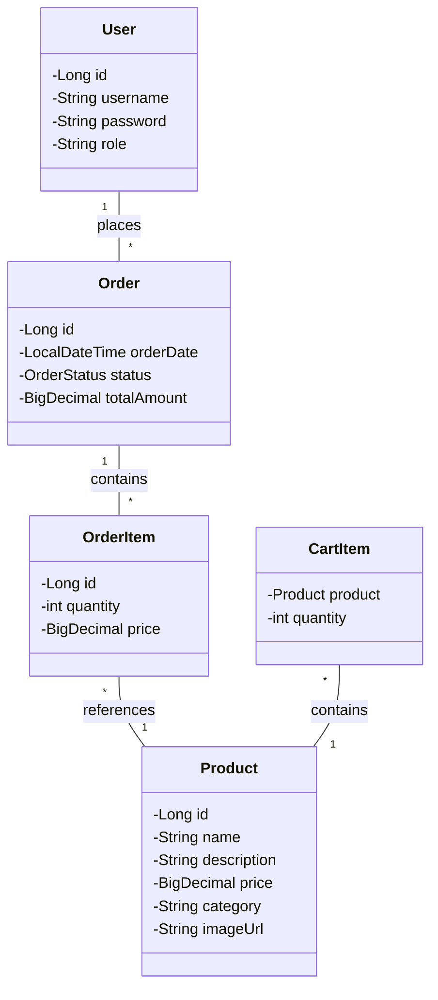

# 🎮 Loja de Brinquedos

## 📝 Sobre o Projeto
Uma loja virtual de brinquedos desenvolvida com Spring Boot. O projeto implementa funcionalidades essenciais de e-commerce, incluindo catálogo de produtos, carrinho de compras, sistema de autenticação e pagamento.

## ✨ Características Principais
- 🛍️ Catálogo de produtos com categorização
- 🛒 Carrinho de compras intuitivo
- 👤 Sistema de autenticação e autorização
- 💳 Integração com pagamento
- 📱 Design responsivo
- 🔍 Busca de produtos
- 👥 Área administrativa para gestão de produtos

## 🛠️ Tecnologias Utilizadas
- Spring Boot 3.3.4
- Spring Security
- Thymeleaf
- MySQL
- Bootstrap
- HTML/CSS

## 📊 Diagrama UML



## 🚀 Como Executar

1. Clone o repositório:
```bash
git clone https://github.com/seu-usuario/toy.git
```

2. Configure o banco de dados MySQL em `application.properties`

3. Execute o projeto:
```bash
./mvnw spring-boot:run
```

4. Acesse: `http://localhost:8080`

## 👥 Equipe
- Desenvolvedor Back-End Stack: Enzo
- Desenvolvedor Full Stack: Felipe
- Developer Front-end: Matheus
- Designer: João

## 🤝 Contribuindo
Contribuições são bem-vindas! Sinta-se à vontade para abrir uma issue ou enviar um pull request.

## 📄 Licença
Este projeto está sob a licença MIT. Veja o arquivo [LICENSE](LICENSE) para mais detalhes.
